<h1 align="center">⚡ Burhan U Din Abdullah, Ph.D.</h1>

  <b>Postdoctoral Researcher | Indian Institute of Science (IISc), Bengaluru</b> 
  <i>Translating Advanced AI and Techno-Economic Analysis into Resilient Global Energy Transitions.</i>

  
  
  

---

### 🏛️ Research Architecture: The Intelligent Grid

My research bridges the intersection of **Artificial Intelligence**, **Power System Stability**, and **Human-Centered Policy**[cite: 7]. I focus on the techno-economic feasibility of renewable-rich, low-inertia infrastructure to support sustainable global energy transitions[cite: 8, 9].

```mermaid
%%{init: {'theme': 'base', 'themeVariables': { 'fontFamily': 'Times New Roman', 'primaryColor': '#0078d4'}}}%%
gantt
    title Research Expertise & Skill Depth
    dateFormat  X
    axisFormat %
    section Core Research
    AI-Assisted Optimization (Ph.D.)   : 0, 95
    Techno-Economic Analysis (Postdoc) : 0, 90
    Grid Modernization & Stability     : 0, 85
    Multimodal Machine Learning        : 0, 80
    Evidence-Based Policy Planning     : 0, 75
```

---

### 🛠️ Technological Arsenal & Competencies

| **⚡ Power Systems** | **🧠 AI & Intelligence** | **📊 Strategy & Economics** |
| :--- | :--- | :--- |
|  [cite: 26] |  [cite: 25] |  [cite: 11] |
|  [cite: 25] |  [cite: 25] |  [cite: 33] |
|  [cite: 27] |  [cite: 25] |  [cite: 48] |
|  [cite: 91] |  [cite: 37] |  [cite: 30] |

---

### 📊 Technical Impact Metrics

  

  

---

### 📚 Global Academic Standing
* **Lead Researcher:** Conducting techno-economic optimization for the **Blue Line Energy Infrastructure** project at **IISc**[cite: 44, 45, 47].
* **Open Source Contributor:** Collaborating with **Harvard SEAS** on **PowerMCP** for agent-driven modeling[cite: 52, 53, 54].
* **Scientific Reviewer:** **Springer Nature** (Scientific Reports), **IEEE**, and **Frontiers**[cite: 96, 97, 98, 100].
* **Certified Expertise:** Strategy from **IIM Ahmedabad** [cite: 33] and IoT from **IIT Bombay**[cite: 32].

---

  <a href="https://scholar.google.com/citations?user=wIvwAasAAAAJ"><b>Google Scholar</b></a> • 
  <a href="https://orcid.org/0009-0008-8205-5721"><b>ORCID</b></a> • 
  <a href="https://www.linkedin.com/in/burhan-abdullah-788501113"><b>LinkedIn</b></a>

