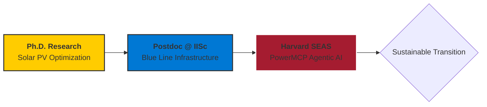

# ⚡ Burhan U Din Abdullah, Ph.D.

**Postdoctoral Researcher at the Indian Institute of Science (IISc), Bengaluru**

*Translating Advanced AI and Techno-Economic Analysis into Resilient Global Energy Transitions.*

  
  
  

---

### 🏛️ Research Architecture: The Intelligent Grid

My research bridges the intersection of **Artificial Intelligence**, **Power System Stability**, and **Human-Centered Policy**. I focus on the techno-economic feasibility of renewable-rich, low-inertia infrastructure to support sustainable global energy transitions.

---

### 🛠️ Technological Arsenal & Verified Skills

| ⚡ **Power Systems** | 🧠 **AI & Intelligence** | 📊 **Strategy & Economics** |
| :--- | :--- | :--- |
|  |  |  |
|  |  |  |
|  |  |  |
|  |  |  |

---

### 📊 Technical Impact Metrics

  

---

### 📚 Global Academic Standing

* **Lead Researcher:** Conducting techno-economic optimization for the **Blue Line Energy Infrastructure** project at **IISc**.
* **Open Source Leadership:** Contributing to **PowerMCP** in collaboration with **Harvard SEAS**.
* **Scientific Reviewer:** **Springer Nature** (Scientific Reports), **IEEE**, **Frontiers**, and **Taylor & Francis**.
* **Certified Expertise:** Strategy from **IIM Ahmedabad**, IoT from **IIT Bombay**, and Data Science from **IBM**.

---

  <a href="https://scholar.google.com/citations?user=wIvwAasAAAAJ"><b>Google Scholar</b></a> • 
  <a href="https://orcid.org/0009-0008-8205-5721"><b>ORCID</b></a> • 
  <a href="https://www.linkedin.com/in/burhan-abdullah-788501113"><b>LinkedIn</b></a>

