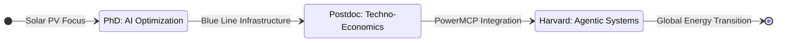

# ⚡ Burhan U Din Abdullah, Ph.D.

**Postdoctoral Researcher at the Indian Institute of Science (IISc), Bengaluru** [cite: 44, 45, 46]

<i>Translating Advanced AI and Techno-Economic Analysis into Resilient Global Energy Transitions.</i> [cite: 7, 9]

  
  
  

---

### 🏛️ Research Architecture & Career Flow

My research integrates <b>Multimodal Machine Learning</b> with <b>Low-Inertia Power Systems</b> to create evidence-based decision support for global energy policy. [cite: 8, 14, 21]

---

### 🛠️ Technological Ecosystem

| ⚡ **Power Engineering** | 🧠 **AI & Intelligence** | 📊 **Strategy & Policy** |
| :--- | :--- | :--- |
|  |  |  |
|  |  |  |
|  |  |  |

---

### 🚀 Leading Research Repositories

* **[PowerMCP](https://github.com/Power-Agent/PowerMCP)** [cite: 52, 91]
  *Architecting agent-driven modeling for intelligent power systems in collaboration with **Harvard SEAS**. [cite: 52, 53]*
* **[Aegis-Grid](https://github.com/BurhanAbdullah/Aegis-Grid)**
  *Developing cryptographic communication frameworks for high-assurance power system operation. [cite: 78]*
* **[PowerRAG](https://github.com/oceanbase/powerrag)**
  *Optimizing multi-modal RAG for industrial-scale energy infrastructure datasets.*

---

### 📊 Technical Impact & Consistency

  

  

---

### 📜 Prestigious Credentials

* **IoT & Machine Learning** | Indian Institute of Technology (IIT), Bombay [cite: 32]
* **Strategy & Game Theory** | Indian Institute of Management (IIM), Ahmedabad [cite: 33]
* **Forward Research Program** | McKinsey & Company
* **Big Data & AI Project Management** | Johns Hopkins University
* **Global Financial Markets** | Rice University [cite: 39]
* **Electric Power Systems** | University at Buffalo & SUNY [cite: 35]

---

  <a href="https://scholar.google.com/citations?user=wIvwAasAAAAJ"><b>Google Scholar</b></a> • 
  <a href="https://orcid.org/0009-0008-8205-5721"><b>ORCID</b></a> • 
  <a href="https://www.linkedin.com/in/burhan-abdullah-788501113"><b>LinkedIn</b></a>

