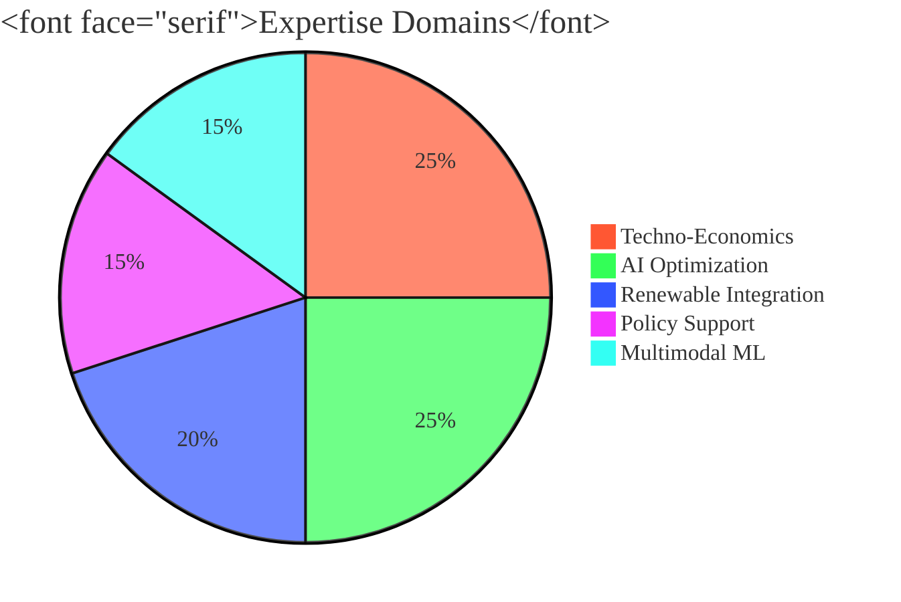

<h1 align="center">⚡ Burhan U Din Abdullah, Ph.D.</h1>

  <b>Postdoctoral Researcher at the Indian Institute of Science (IISc), Bengaluru</b> [cite: 44, 45] 
  <i>Interdisciplinary Scientist | AI for Energy Systems | Techno-Economic Strategist</i> [cite: 7]

  
  

---

### 🏛️ Research Architecture & Vision

I specialize in the resilience and optimization of renewable-rich, low-inertia power systems[cite: 8, 13]. My research aims to translate advanced computational methods into socially meaningful and economically viable infrastructure solutions[cite: 9].

---

### 🛠️ Full Technical Skill Matrix

| **Energy & Power** [cite: 18, 20, 26, 27] | **AI & Data Science** [cite: 19, 25, 37] | **Strategy & Policy** [cite: 21, 30, 33] |
| :--- | :--- | :--- |
|  |  |  |
|  |  |  |
|  |  |  |
|  |  |  |
|  |  |  |

---

### 🚀 Key Professional Milestones

* **Postdoctoral Research (IISc Bengaluru):** Techno-economic analysis of the Blue Line infrastructure project[cite: 46, 47].
* **Open Source Leadership (Harvard SEAS):** Contributor to PowerMCP for agent-driven power systems[cite: 52, 53, 54].
* **Ph.D. Research:** Intelligent control and AI assisted optimization of solar PV[cite: 75, 78].

---

### 📚 Global Academic Impact
* **Reviewer Excellence:** Springer Nature, IEEE Young Professionals, Frontiers, and Taylor & Francis[cite: 96, 97, 98, 100].
* **Core Competencies:** Interdisciplinary collaboration, research leadership, and academic writing.

---

### 📊 Contribution Activity

  

---

  <a href="https://scholar.google.com/citations?user=wIvwAasAAAAJ"><b>Scholar</b></a> • 
  <a href="https://orcid.org/0009-0008-8205-5721"><b>ORCID</b></a> • 
  <a href="https://www.linkedin.com/in/burhan-abdullah-788501113"><b>LinkedIn</b></a>

