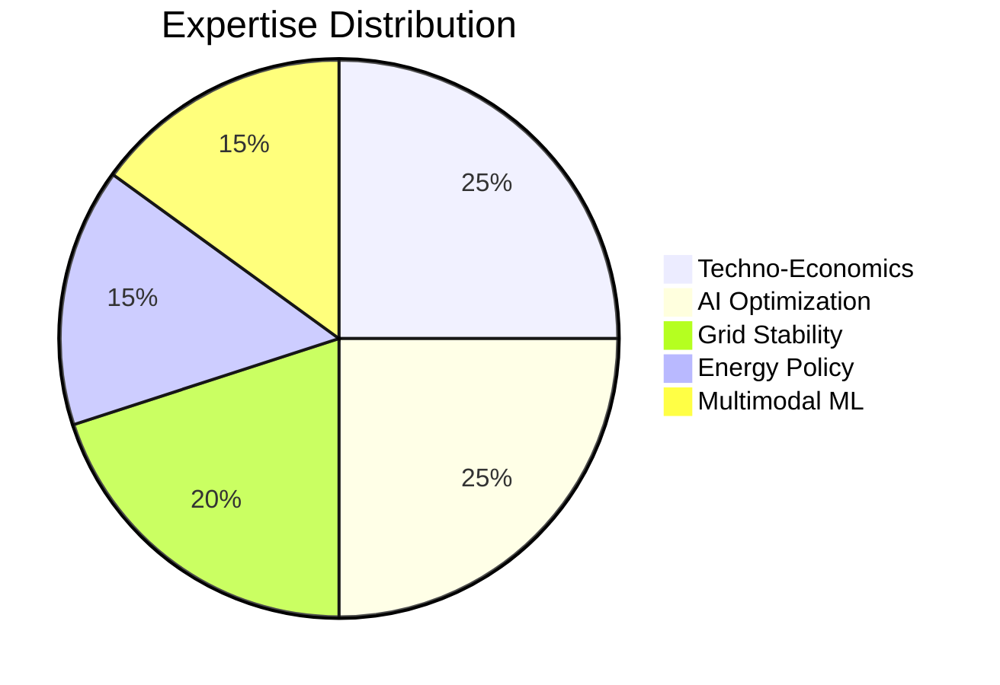

<h1 align="center">⚡ Burhan U Din Abdullah, Ph.D.</h1>

  <b>Postdoctoral Researcher at the Indian Institute of Science (IISc), Bengaluru</b> 
  <i>Interdisciplinary Scientist | AI for Energy Systems | Techno-Economic Strategist</i>

  
  
  

---

### 🏛️ Research Architecture & Vision
I specialize in the resilience and optimization of renewable-rich, low-inertia power systems. My work bridges the gap between traditional electrical engineering and agentic artificial intelligence.

---

### 🚀 Professional Milestones

#### 🎓 **Education & Research Excellence**
* **Ph.D. in Electrical Engineering (2025):** Focus on intelligent control and AI-assisted optimization for secure solar PV infrastructure.
* **Postdoctoral Fellowship (IISc Bengaluru):** Leading techno-economic modeling for the **Blue Line energy infrastructure** project.
* **PowerMCP (Harvard SEAS):** Architecting open-source agent-driven frameworks for intelligent power system modeling.

#### 🛠️ **Technological Arsenal**
* **Power Engineering:** PowerWorld, MATLAB/Simulink, PSCAD, OpenDSS.
* **AI/ML & Data:** PyTorch, R, Python, Multimodal Machine Learning.
* **Policy Analytics:** NVivo Qualitative Analysis, Scenario-based evaluation.

---

### 📊 GitHub Activity

  

---

### 📚 Global Academic Impact
* **Scientific Reviewer:** Contributing to **Springer Nature**, **IEEE** Young Professionals, **Frontiers**, and **Taylor & Francis**.
* **Specialized Training:** Strategy & Game Theory (**IIM Ahmedabad**), IoT (**IIT Bombay**), and Big Data (**Johns Hopkins**).

---

### 🔗 Portfolio & Networks

  <a href="https://scholar.google.com/citations?user=wIvwAasAAAAJ"><b>Google Scholar</b></a> • 
  <a href="https://orcid.org/0009-0008-8205-5721"><b>ORCID</b></a> • 
  <a href="https://www.linkedin.com/in/burhan-abdullah-788501113"><b>LinkedIn</b></a> •
  <a href="https://burhanabdullah.github.io/"><b>Personal Website</b></a>

