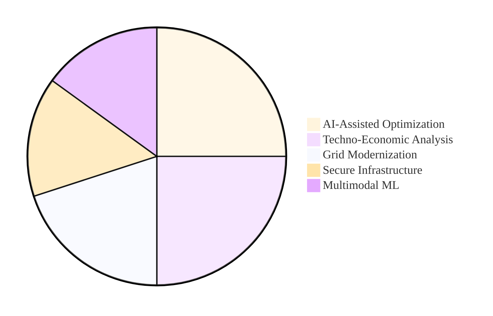

# ⚡ Burhan U Din Abdullah, Ph.D.

**Postdoctoral Researcher at the Indian Institute of Science (IISc), Bengaluru**

  
  
  

---

### 🏛️ Research Architecture & Vision

My research integrates <b>Multimodal Machine Learning</b> with <b>Low-Inertia Power Systems</b> to create evidence-based decision support for global energy policy.

<h4 align="center">Domain Expertise & Research Focus</h4>

---

### 🛠️ Technical Ecosystem

<table align="center" style="width: 100%; border-collapse: collapse; font-family: 'Times New Roman', serif; text-align: center;">
  <tr>
    <th style="background-color: #E67E22; color: white; padding: 15px; font-size: 20px;">⚡ Power Engineering</th>
    <th style="background-color: #C0392B; color: white; padding: 15px; font-size: 20px;">🧠 AI & Intelligence</th>
    <th style="background-color: #2980B9; color: white; padding: 15px; font-size: 20px;">📊 Strategy & Policy</th>
  </tr>
  <tr style="font-size: 16px;">
    <td style="padding: 15px; border: 1px solid #ddd;"><b>Power Systems Analysis</b> Grid Stability & Renewables</td>
    <td style="padding: 15px; border: 1px solid #ddd;"><b>Generative AI</b> Agentic LLM Frameworks</td>
    <td style="padding: 15px; border: 1px solid #ddd;"><b>Techno-Economics</b> Infrastructure Modeling</td>
  </tr>
  <tr style="font-size: 16px;">
    <td style="padding: 15px; border: 1px solid #ddd;"><b>Converter Systems</b> Inverter Modernization</td>
    <td style="padding: 15px; border: 1px solid #ddd;"><b>Machine Learning</b> IoT Data Forecasting</td>
    <td style="padding: 15px; border: 1px solid #ddd;"><b>Game Theory</b> Strategic Optimization</td>
  </tr>
  <tr style="font-size: 16px;">
    <td style="padding: 15px; border: 1px solid #ddd;"><b>Industrial Software</b> PowerWorld & PSCAD</td>
    <td style="padding: 15px; border: 1px solid #ddd;"><b>Big Data</b> Hadoop & Scalable ML</td>
    <td style="padding: 15px; border: 1px solid #ddd;"><b>Project Management</b> Technical Policy Planning</td>
  </tr>
</table>

---

### 📜 Prestigious Academic Certifications

<table align="center" style="width: 100%; font-family: 'Times New Roman', serif; border-spacing: 15px;">
  <tr>
    <td align="center"><b>IIT Bombay</b> Internet of Things & ML</td>
    <td align="center"><b>IIM Ahmedabad</b> Strategy & Game Theory</td>
  </tr>
  <tr>
    <td align="center"><b>McKinsey & Co.</b> Forward Research Program</td>
    <td align="center"><b>Johns Hopkins University</b> Big Data & AI Management</td>
  </tr>
</table>

---

### 🎓 Institutional Heritage

  
  
  
  

  <a href="https://scholar.google.com/citations?user=wIvwAasAAAAJ"><b>Google Scholar</b></a> • 
  <a href="https://orcid.org/0009-0008-8205-5721"><b>ORCID</b></a> • 
  <a href="https://www.linkedin.com/in/burhan-abdullah-788501113"><b>LinkedIn</b></a>

