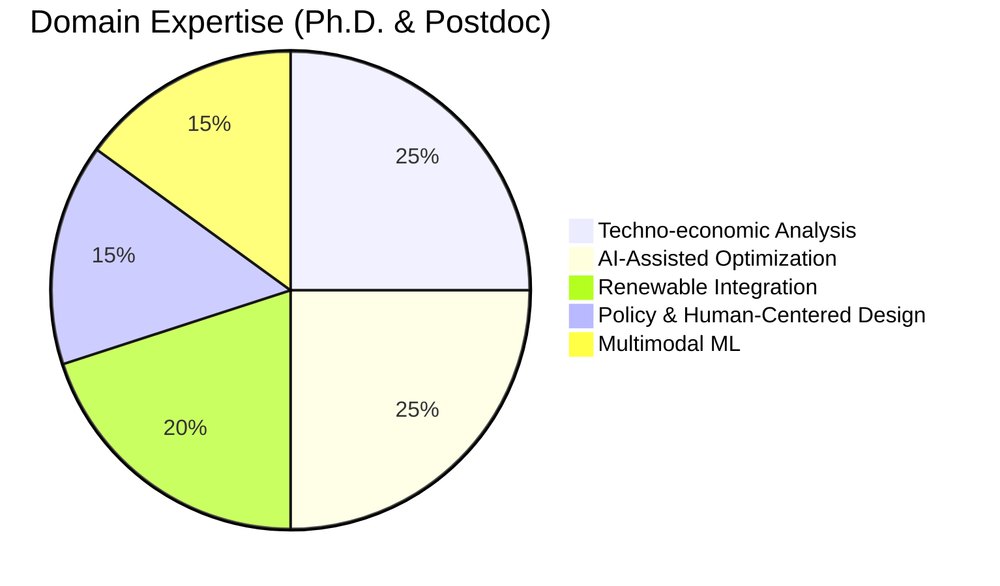

# 
⚡ Burhan U Din Abdullah, Ph.D.

  <b>Postdoctoral Researcher @ Indian Institute of Science (IISc), Bengaluru</b> 
  <i>Interdisciplinary Researcher: AI for Energy Systems | Techno-Economic Policy | Human-Centered Systems</i>

---

### 🏛️ Research Architecture & Vision
I bridge the gap between heavy-duty power system engineering and agentic AI to support global energy transitions.

---

### 🚀 Key Professional Milestones

#### 🎓 **Education & Research**
* **Ph.D. in Electrical Engineering (2025):** Focused on intelligent control and AI optimization for grid-connected solar PV systems[cite: 75, 76, 78].
* **Postdoctoral Fellowship (IISc):** Leading techno-economic evaluation for the **Blue Line energy infrastructure project**[cite: 44, 45, 47].
* **Harvard SEAS (PowerMCP):** Architecting open agent-driven frameworks for industrial power software[cite: 52, 53, 91].

#### 🛠️ **Technological Arsenal**
* **Energy Intelligence:** PowerWorld, MATLAB/Simulink, PSCAD, OpenDSS[cite: 25, 26, 27].
* **AI/ML Stack:** PyTorch, R, Python, Multimodal Machine Learning[cite: 14, 25].
* **Strategic Policy:** Techno-economic assessment, NVivo Qualitative Analysis, Scenario Modeling[cite: 11, 30, 49].

---

### 📚 Impact & Global Recognition
* **Scientific Peer Review:** * *Springer Nature:* Scientific Reports, Discover Applied Sciences[cite: 96].
    * *IEEE:* Young Professionals Technical Evaluation[cite: 100].
    * *Frontiers & Taylor & Francis:* Microgrids & Intelligent Power Systems[cite: 97, 98].
* **Selected Certifications:** Strategy & Game Theory (IIM Ahmedabad), IoT (IIT Bombay), Data Science (IBM)[cite: 32, 33, 34].

---

### 🔗 Connect & Collaborate

  <a href="https://scholar.google.com/citations?user=wIvwAasAAAAJ"><b>Google Scholar</b></a> • 
  <a href="https://orcid.org/0009-0008-8205-5721"><b>ORCID</b></a> • 
  <a href="https://www.linkedin.com/in/burhan-abdullah-788501113"><b>LinkedIn</b></a>

