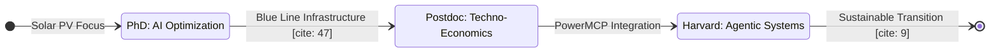

  
  
  # ⚡ Burhan U Din Abdullah, Ph.D.
  
  **Postdoctoral Researcher at the Indian Institute of Science (IISc), Bengaluru** [cite: 44, 45, 46]
  
  *Translating Advanced AI and Techno-Economic Analysis into Resilient Global Energy Transitions.* [cite: 7, 9]
  
  

    
    
    
  

---

### 🏛️ Research Architecture: The Intelligent Grid

My work integrates **Multimodal Machine Learning** with **Low-Inertia Power Systems** to create evidence-based decision support for global energy policy. [cite: 7, 8, 14, 21]

---

### 🛠️ Technical Ecosystem & Mastery

| ⚡ Power Systems [cite: 26, 27] | 🧠 AI & Data Intelligence [cite: 25, 37] | 📊 Strategy & Economics [cite: 11, 33, 40] |
| :--- | :--- | :--- |
|  |  |  |
|  |  |  |
|  |  |  |

---

### 📊 Research Metrics & Global Contributions

  

#### **Academic Service & Certifications**
* **Scientific Reviewer:** Springer Nature, IEEE, Frontiers, and Taylor & Francis. [cite: 96, 97, 98, 100]
* **Selected Training:** **IoT** (IIT Bombay) [cite: 32], **Strategy** (IIM Ahmedabad) [cite: 33], **Data Science** (IBM)[cite: 34].
* **Impact:** Mentoring future leaders via **Student Energy**. [cite: 95]

---

  <a href="https://scholar.google.com/citations?user=wIvwAasAAAAJ"><b>Google Scholar</b></a> • 
  <a href="https://orcid.org/0009-0008-8205-5721"><b>ORCID</b></a> • 
  <a href="https://www.linkedin.com/in/burhan-abdullah-788501113"><b>LinkedIn</b></a>

