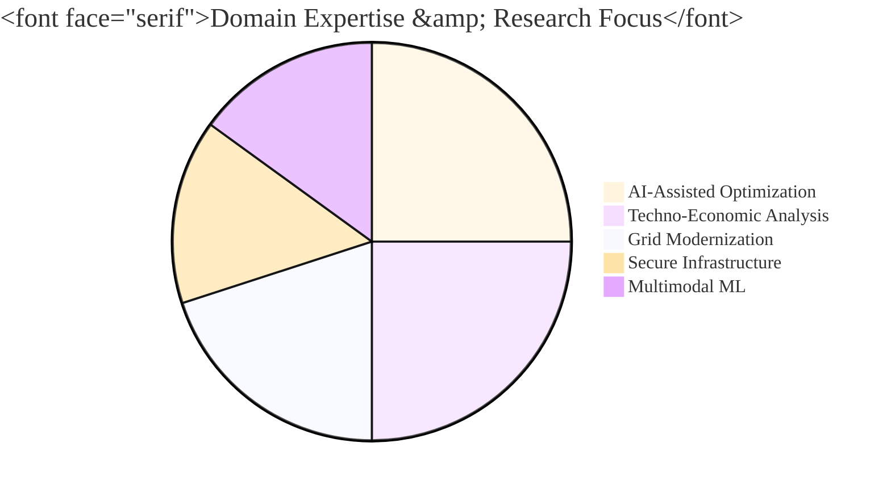

# ⚡ Burhan U Din Abdullah, Ph.D.

**Postdoctoral Researcher at the Indian Institute of Science (IISc), Bengaluru**

<i>Translating Advanced AI and Techno-Economic Analysis into Resilient Global Energy Transitions.</i>

  
  
  

---

### 🏛️ Research Architecture & Vision

My research integrates <b>Multimodal Machine Learning</b> with <b>Low-Inertia Power Systems</b> to create evidence-based decision support for global energy policy.

---

### 🛠️ Technical Ecosystem

| ⚡ **Power Engineering** | 🧠 **AI & Intelligence** | 📊 **Strategy & Policy** |
| :--- | :--- | :--- |
|  |  |  |
|  |  |  |
|  |  |  |

---

### 📜 Prestigious Certifications

<table align="center" style="width: 100%;">
  <tr>
    <td><b>IIT Bombay</b>: Internet of Things & Machine Learning</td>
    <td><b>IIM Ahmedabad</b>: Strategy & Game Theory</td>
  </tr>
  <tr>
    <td><b>McKinsey & Co.</b>: Forward Research Program</td>
    <td><b>Johns Hopkins</b>: Big Data & AI Project Management</td>
  </tr>
  <tr>
    <td><b>Rice University</b>: Risk Management & Finance</td>
    <td><b>University at Buffalo</b>: Electric Power Systems</td>
  </tr>
</table>

---

### 📊 Research Metrics & Activity

  

---

  <a href="https://scholar.google.com/citations?user=wIvwAasAAAAJ"><b>Google Scholar</b></a> • 
  <a href="https://orcid.org/0009-0008-8205-5721"><b>ORCID</b></a> • 
  <a href="https://www.linkedin.com/in/burhan-abdullah-788501113"><b>LinkedIn</b></a>

