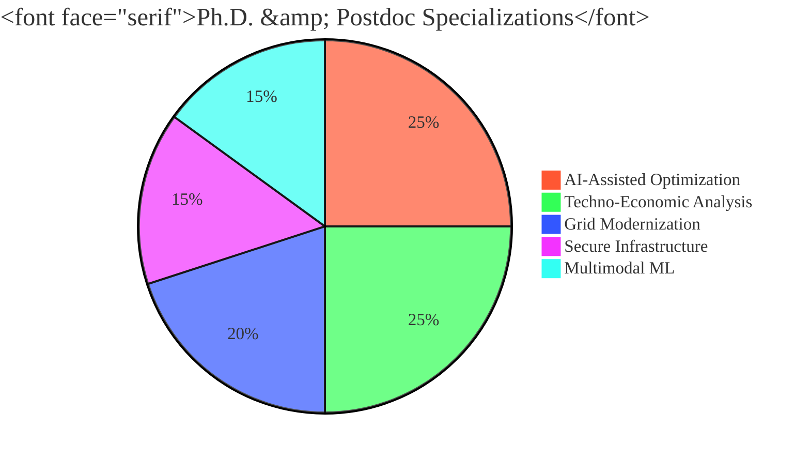

<h1 align="center">⚡ Burhan U Din Abdullah, Ph.D.</h1>

  <b>Postdoctoral Researcher | Indian Institute of Science (IISc), Bengaluru</b> 
  <i>Architecting the future of Intelligent, Autonomous, and Resilient Power Grids.</i>

  
  
  

---

### 🏛️ Research Architecture: The Agentic Grid

I bridge the gap between heavy-duty power system engineering and agentic AI. My research focuses on renewable-rich, low-inertia systems, translating advanced ML into economically viable infrastructure[cite: 8, 9, 13].

---

### 🛠️ Technological Arsenal (Verified Competencies)

| **⚡ Power Systems** | **🧠 AI & Data Science** | **📊 Strategy & Policy** |
| :--- | :--- | :--- |
|  |  |  |
|  |  |  |
|  |  |  |
|  |  |  |

---

### 🚀 Leading Projects
* **[PowerMCP](https://github.com/Power-Agent/PowerMCP):** Collaborating with **Harvard SEAS** to create agent-driven modeling for intelligent power systems[cite: 52, 91].
* **Blue Line Infrastructure:** Leading techno-economic modeling and cost optimization at **IISc Bengaluru**[cite: 47, 48].
* **[Aegis-Grid](https://github.com/BurhanAbdullah/Aegis-Grid):** Cryptographic frameworks for high-assurance power system communication.

---

### 📊 Research Activity & Global Impact

  

> **Note:** Peer reviewer for **Springer Nature**, **IEEE**, and **Frontiers**[cite: 96, 97, 98, 100]. Training from **IIM Ahmedabad**, **IIT Bombay**, and **Johns Hopkins**[cite: 32, 33, 37].

---

  <a href="https://scholar.google.com/citations?user=wIvwAasAAAAJ"><b>Google Scholar</b></a> • 
  <a href="https://orcid.org/0009-0008-8205-5721"><b>ORCID</b></a> • 
  <a href="https://www.linkedin.com/in/burhan-abdullah-788501113"><b>LinkedIn</b></a>

