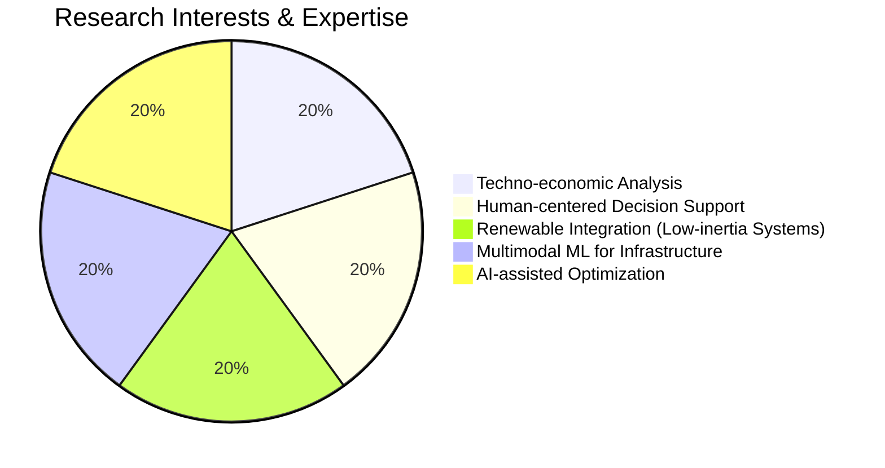
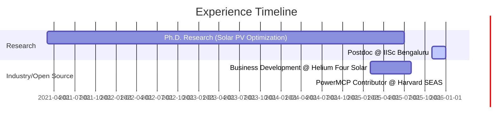

# ⚡ Burhan U Din Abdullah, Ph.D.
[cite_start]**Postdoctoral Researcher @ Indian Institute of Science (IISc), Bengaluru** [cite: 44, 45, 46]
[cite_start]*Interdisciplinary researcher at the intersection of AI for energy systems, techno-economic analysis, and human-centered decision support.* [cite: 7]

---

### 🏛️ Research Architecture
[cite_start]My research focuses on renewable-rich and low-inertia power systems, data-driven modeling, and policy-relevant evaluation of large-scale energy infrastructure. [cite: 8]

[cite_start]*(Interests visualized from CV data [cite: 11, 12, 13, 14, 15])*

---

### 🚀 Professional Experience & Milestones

[cite_start]*(Timeline data derived from Professional Experience & Education sections [cite: 46, 54, 60, 66, 76])*

#### **Key Highlights:**
* [cite_start]**IISc Bengaluru:** Conducting techno-economic analysis of the Blue Line energy infrastructure project and cost optimization. [cite: 47, 48]
* [cite_start]**Harvard SEAS (PowerMCP):** Contributing to open frameworks for agent-driven modeling of intelligent power systems. [cite: 52, 53, 55]
* [cite_start]**Education:** Ph.D. in Electrical Engineering (2025) focused on AI-assisted optimization of grid-connected solar PV systems. [cite: 75, 76, 78]

---

### 🛠️ Technical Toolkit & Certifications
[cite_start]**Core Competencies:** [cite: 17]
* [cite_start]**Energy Modeling:** Techno-economic assessment, Grid modernization, and Microgrids. [cite: 18, 20]
* [cite_start]**Data Science:** Machine learning (PyTorch), Data-driven modeling, and Statistical analysis. [cite: 19, 22, 25]
* [cite_start]**Industrial Software:** Power World, MATLAB Simulink, and PSCAD. [cite: 25, 26, 27]

[cite_start]**Selected Training:** [cite: 31]
* [cite_start]**IoT** (IIT Bombay) [cite: 32] | [cite_start]**Game Theory** (IIM Ahmedabad) [cite: 33] | [cite_start]**Data Science** (IBM) [cite: 34]
* [cite_start]**Electric Power Systems** (University at Buffalo) [cite: 35] | [cite_start]**Global Financial Markets** (Rice University) [cite: 39]

---

### 📚 Academic Service & Impact
* [cite_start]**Reviewer:** Springer Nature (Scientific Reports), IEEE Young Professionals, Frontiers, and Taylor & Francis. [cite: 96, 97, 98, 100]
* [cite_start]**Mentorship:** Supporting early-career researchers via **Student Energy**. [cite: 95]

---
[cite_start]📫 **Connect:** [LinkedIn](https://www.linkedin.com/in/burhan-abdullah-788501113) [cite: 4] | [cite_start][ORCID](https://orcid.org/my-orcid?orcid=0009-0008-8205-5721) [cite: 5] | [Google Scholar](https://scholar.google.com/citations?user=wIvwAasAAAAJ)
