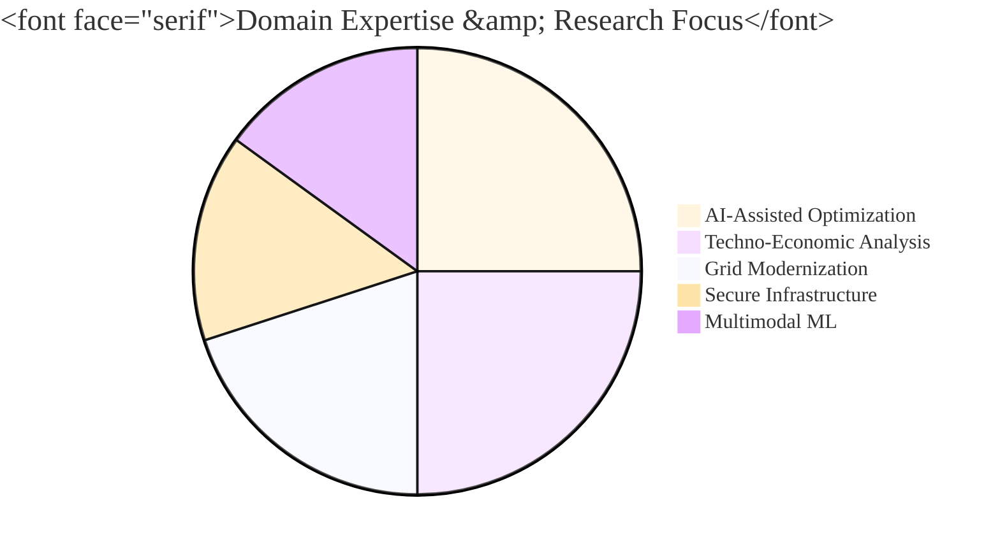

# ⚡ Burhan U Din Abdullah, Ph.D.

**Postdoctoral Researcher at the Indian Institute of Science (IISc), Bengaluru**

<i>Translating Advanced AI and Techno-Economic Analysis into Resilient Global Energy Transitions.</i>

  
  
  

---

### 🏛️ Research Architecture & Vision

My research integrates <b>Multimodal Machine Learning</b> with <b>Low-Inertia Power Systems</b> to create evidence-based decision support for global energy policy. I focus on the techno-economic feasibility of renewable-rich infrastructure to support sustainable energy transitions.

---

### 🛠️ Technological Ecosystem & Mastery

<table align="center" style="width: 100%; text-align: center; border-collapse: collapse;">
  <tr style="border-bottom: 2px solid #0078d4;">
    <th>⚡ Power Engineering</th>
    <th>🧠 AI & Intelligence</th>
    <th>📊 Strategy & Policy</th>
  </tr>
  <tr>
    <td></td>
    <td></td>
    <td></td>
  </tr>
  <tr>
    <td></td>
    <td></td>
    <td></td>
  </tr>
  <tr>
    <td></td>
    <td></td>
    <td></td>
  </tr>
</table>

---

### 🚀 Project Portfolio & Open Source

* **[PowerMCP](https://github.com/Power-Agent/PowerMCP)**: Architecting agent-driven modeling with **Harvard SEAS**.
* **[Aegis-Grid](https://github.com/BurhanAbdullah/Aegis-Grid)**: High-assurance cryptographic grid communication.
* **[PowerRAG](https://github.com/oceanbase/powerrag)**: Multi-modal retrieval for industrial energy data.

---

### 📜 Prestigious Certifications

<table align="center" style="width: 100%; border-collapse: collapse;">
  <tr>
    <td style="padding: 10px;"><b>IIT Bombay</b>: Internet of Things & Machine Learning</td>
    <td style="padding: 10px;"><b>IIM Ahmedabad</b>: Strategy & Game Theory</td>
  </tr>
  <tr>
    <td style="padding: 10px;"><b>McKinsey & Co.</b>: Forward Research Program</td>
    <td style="padding: 10px;"><b>Johns Hopkins</b>: Big Data & AI Project Management</td>
  </tr>
  <tr>
    <td style="padding: 10px;"><b>Rice University</b>: Risk Management & Finance</td>
    <td style="padding: 10px;"><b>University at Buffalo</b>: Electric Power Systems</td>
  </tr>
</table>

---

  <a href="https://scholar.google.com/citations?user=wIvwAasAAAAJ"><b>Google Scholar</b></a> • 
  <a href="https://orcid.org/0009-0008-8205-5721"><b>ORCID</b></a> • 
  <a href="https://www.linkedin.com/in/burhan-abdullah-788501113"><b>LinkedIn</b></a>

