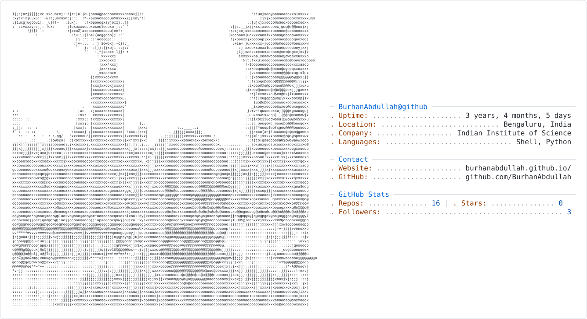

<picture>
  <source media="(prefers-color-scheme: dark)" srcset="dark_mode.svg" />
  <source media="(prefers-color-scheme: light)" srcset="light_mode.svg" />
  
</picture>

<h3 align="center">Research · Power Systems · Renewable Energy · Artificial Intelligence</h3>

  <a href="https://burhanabdullah.github.io/">Website</a>
  ·
  <a href="https://scholar.google.com/citations?user=wIvwAasAAAAJ&hl=en">Google Scholar</a>
  ·
  <a href="https://github.com/BurhanAbdullah">GitHub</a>

---

### Research

I work at the intersection of power-system engineering, renewable-energy integration, intelligent energy systems, and AI-driven analysis.

**Focus areas:** Power Systems · Grid Stability · Renewable Energy · Microgrids · AI for Energy · Cyber-Physical Resilience · Optimization

### Selected work

- **XMON-Grid / AEGIS-Grid** — resilient monitoring and cyber-physical power-system research
- **Hybrid Renewable Energy Systems** — mathematical modelling and grid-forming control
- **Solar–Rail Integration** — solarisation and energy modelling for metro systems
- **Smart Energy Systems** — forecasting, optimization, storage and intelligent EMS

### Open source

My public repositories contain research code, mathematical models, experiments, datasets, and reproducibility resources.

  
  
  
  

  <a href="https://burhanabdullah.github.io/projects.html">
    <strong>Explore Projects →</strong>
  </a>

